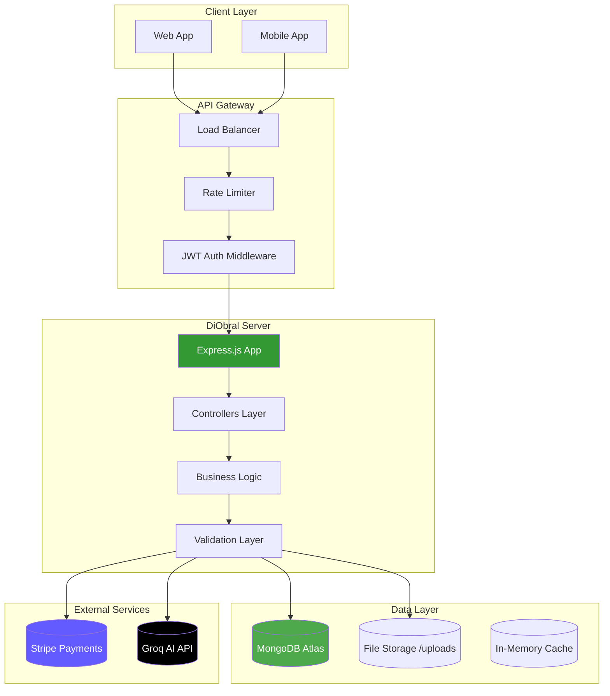
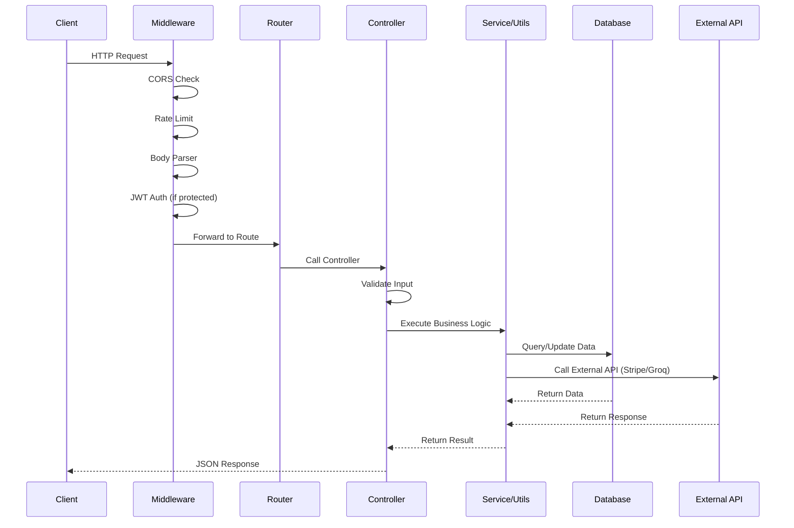
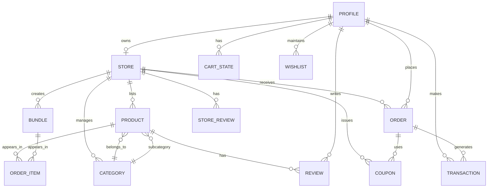

# DiObral Server


[](package.json)
[](#api-routes)
[](LICENSE)
[](#contributing)
[](#)
[](https://github.com/BazilSuhail/)

**Author:** [**Bazil Suhail**](https://github.com/BazilSuhail/)

---

## What is DiObral?

**DiObral** is a full-featured, production-ready e-commerce API built for premium clothing and wearable marketplaces. It powers the DiObral Online Marketplace — a multi-vendor platform where retailers manage stores, products, bundles, and orders, while customers browse, shop, review, and checkout with an AI-powered shopping assistant.

> **DiObral** = *Digital* + *Obral* (Indonesian for "wholesale/market") — a digital marketplace built for scale, speed, and intelligent shopping.

> ### 💡 Looking for the diagrams?
> Head straight to the **[Mermaid Diagrams →](#mermaid-diagrams)** section at the very end of this README —
> or <a href="#mermaid-diagrams" title="System Architecture · Request Lifecycle · Order Lifecycle · Domain Model">hover here &amp; click to jump to the 4 Mermaid diagrams&nbsp;→</a>

---

## Features

### Customer-Facing

| Feature | Description |
|---------|-------------|
| **Product Catalog** | Browse products with advanced filtering (price, category, size, availability), sorting, and real-time search |
| **Product Discovery** | Dynamic grid/list views, keyword search with debouncing, URL-synced filters |
| **Product Details** | Image gallery, specifications, stock status, dynamic pricing with sales/discounts |
| **Shopping Cart** | Real-time quantity adjustments, automatic subtotal calculations, hybrid persistence (local + server) |
| **Checkout** | Multi-step secure checkout with shipping address entry and order confirmation |
| **Order Tracking** | View past orders, track status (pending → shipped → delivered), reorder functionality |
| **Reviews & Ratings** | Submit star ratings and written feedback, aggregated metrics per product |
| **Store Reviews** | Rate and review stores independently of products |
| **Wishlist** | Save favorite products across sessions |
| **Follow Stores** | Follow preferred retailers for updates |
| **Coupons** | Apply discount codes at checkout |
| **Bundles** | Purchase curated product bundles at discounted prices |
| **AI Shopping Assistant** | Voice/text agentic bot that searches products, manages cart, places orders, and answers questions |

### Retailer-Facing

| Feature | Description |
|---------|-------------|
| **Store Management** | Create and customize store profile, logo, banner, policies, and social links |
| **Product Management** | Full CRUD for products with image uploads, category assignment, and inventory tracking |
| **Category Management** | Create and manage custom product categories and subcategories |
| **Order Management** | View incoming orders, update fulfillment status, add tracking numbers |
| **Coupon Management** | Create, update, and delete discount coupons |
| **Bundle Management** | Create product bundles with images and custom pricing |
| **Dashboard** | Analytics overview with order stats and performance metrics |
| **Review Moderation** | Manage customer reviews and store reviews |

### Platform & Infrastructure

| Feature | Description |
|---------|-------------|
| **Authentication** | JWT-based registration, login, profile management, role-based access (customer/retailer) |
| **Rate Limiting** | 7 distinct rate limiters for different endpoint types (auth, search, payment, etc.) |
| **File Uploads** | Multer-based image uploads for products, stores, and bundles |
| **Payment Processing** | Stripe integration with payment intents, webhook verification, and order confirmation |
| **Search Engine** | Keyword-based full-text search on product names and descriptions with MongoDB text indexes |
| **CORS** | Configurable cross-origin resource sharing |
| **Security** | HTTP-only JWT, bcrypt password hashing, input validation, rate limiting |
| **Health Check** | Server status endpoint for monitoring |

---

## Installation

```bash
# Clone the repository
git clone https://github.com/BazilSuhail/DiObral-Backend.git
cd DiObral-Backend

# Install dependencies
npm install
```

### Prerequisites

| Tool | Version |
|------|---------|
| **Node.js** | Latest LTS |
| **npm** | 8+ |
| **MongoDB** | Atlas account or a local instance |

---

## Getting Started

### 1. Configure environment

```bash
cp .env.example .env
# Edit .env with your MongoDB URI, JWT_SECRET, Groq API key, and Stripe keys
```

```env
# Server
PORT=3000
NODE_ENV=development

# Database
MONGODB_URI=mongodb://<host>:<port>/<db>?replicaSet=...&authSource=admin

# Authentication
JWT_SECRET=<your-jwt-secret>

# AI Assistant
GROQ_API_KEY=<your-groq-api-key>

# Payments (Stripe)
STRIPE_SECRET_KEY=sk_test_...
STRIPE_PUBLISHABLE_KEY=pk_test_...
STRIPE_WEBHOOK_SECRET=whsec_...
```

### 2. Run the server

```bash
# Run in development mode (nodemon)
npm run dev

# Or run in production mode
npm run start:prod
```

Server starts at `http://localhost:3000` — hit `GET /` for the health check.

---

## Tech Stack

| Technology | Purpose | Version |
|------------|---------|---------|
| **Node.js** | Runtime | Latest LTS |
| **Express.js** | Web Framework | 5.2.1 |
| **MongoDB** | Database (Atlas) | — |
| **Mongoose** | ODM | 9.10.4 |
| **JWT** | Authentication | 9.0.3 |
| **bcryptjs** | Password Hashing | 3.0.3 |
| **Stripe** | Payment Processing | 22.6.2 |
| **Groq API** | AI Shopping Assistant | — |
| **Multer** | File Uploads | 2.4.0 |
| **express-rate-limit** | Rate Limiting | 8.7.0 |
| **express-validator** | Input Validation | 7.3.2 |
| **CORS** | Cross-Origin Requests | 2.8.6 |
| **body-parser** | Body Parsing | 2.3.0 |
| **dotenv** | Environment Config | 17.4.2 |
| **nodemon** | Dev Auto-Reload | 3.1.14 |

---

## Functionalities

### 1. Authentication & Authorization

- **Registration**: Email/password with role selection (`customer` or `retailer`)
- **Login**: JWT token generation with role claims
- **Profile**: View and update profile information
- **Role Upgrade**: Customers can upgrade to retailer accounts
- **Protected Routes**: `auth` middleware guards retailer and customer-specific endpoints
- **Rate Limiting**: Separate limiters for login (10/15min), registration (5/hr), and general auth (10/15min)

### 2. Product & Store Management

- **Products**: CRUD operations with image uploads, category/subcategory linking, pricing, stock, sizes, tags, and active status
- **Stores**: Create/update store profiles with branding, policies, contact info, and social links
- **Categories**: Hierarchical category system with root categories (`gym-hoodies`, `shorts`, `t-shirts`, `trousers`, `tank-tops`, `compressions`)
- **Text Search**: MongoDB full-text search indexes on `name` and `description` fields

### 3. Shopping Experience

- **Cart**: Add, update, remove items; clear cart; automatic subtotal calculations
- **Checkout**: Create order from cart, validate stock, calculate totals
- **Payment**: Stripe payment intent creation, verification, webhook handling
- **Orders**: Order history, individual order details, status tracking, order statistics

### 4. Reviews & Social

- **Product Reviews**: Authenticated customers submit ratings (1-5 stars) and text reviews
- **Store Reviews**: Rate stores with aggregated metrics
- **Review Management**: Users can update/delete their reviews; view their review history

### 5. Promotions & Bundles

- **Coupons**: Percentage/fixed-amount discounts with retailer CRUD and public validation
- **Bundles**: Curated product sets with group pricing and discount logic

### 6. AI Shopping Assistant

- **Groq-Powered NLP**: Multi-turn agentic assistant using Groq's native function calling
- **10 Tools**: `search_products`, `get_product`, `get_storefront`, `list_stores`, `get_cart`, `add_to_cart`, `place_order`, `get_orders`, `get_order`, `navigate`
- **Voice/Text Support**: Frontend widget supports both input modes
- **Stateless**: No embeddings, memory, or personalization for MVP
- **Refusal Handling**: Exact refusal message for out-of-scope requests

### 7. Dashboard

- **Retailer Analytics**: Order statistics, performance overview

---

## How It Works

### Request Flow

```
Client → CORS → Rate Limiter → Body Parser → JWT Auth (if protected)
    → Route Matcher → Validation → Controller → Business Logic
    → Database / Stripe / Groq → JSON Response
```

### Authentication Flow

1. **Register**: `POST /auth/register` — validates input, hashes password, creates `Profile` with role
2. **Login**: `POST /auth/login` — verifies credentials, returns JWT
3. **Protected Request**: Client sends `Authorization: Bearer <token>` header
4. **Auth Middleware**: Verifies JWT, attaches `req.user` with `{ id, role }`
5. **Route Guard**: Retailer routes check `req.user.role === 'retailer'`

### Order Flow

1. **Browse**: Customer views products via `GET /api/products`
2. **Cart**: Adds items via `POST /cart/add`
3. **Checkout**: `POST /checkout` creates `Order` with `paymentStatus: 'requires_payment'`
4. **Payment**: `POST /payment/intent` creates Stripe PaymentIntent
5. **Webhook**: Stripe confirms payment → server updates order status to `paid`
6. **Fulfillment**: Retailer updates order status via `PATCH /retailer/orders/:id/status`

### AI Assistant Flow

1. **Message**: Client sends text/voice transcript to `POST /assistant`
2. **Groq API**: Server sends conversation + 10 tool definitions to Groq
3. **Tool Call**: Groq returns `tool_calls` (e.g., `search_products` with `{ query: "hoodies" }`)
4. **Execution**: Server executes tool against MongoDB
5. **Response**: Server sends tool result back to Groq → final natural language response
6. **Loop**: Up to 3 tool-call iterations per message

> 📊 Prefer visuals? The same flows are drawn out in the **[Mermaid Diagrams →](#mermaid-diagrams)** section at the end.

---

## API Routes

### Base URL
```
http://localhost:3000
```

### Public Routes

| Method | Endpoint | Description |
|--------|----------|-------------|
| `GET` | `/` | Health check |
| `GET` | `/api/home` | Homepage data (heavy limiter) |
| `GET` | `/api/products` | List products (search limiter) |
| `GET` | `/api/products/:id` | Get single product |
| `GET` | `/api/bundles` | List public bundles (search limiter) |
| `GET` | `/api/stores` | List all stores |
| `GET` | `/api/stores/:slug` | Get storefront by slug |
| `GET` | `/categories` | List categories |
| `GET` | `/categories/:id` | Get single category |
| `GET` | `/bundles/store/:storeId` | Get store bundles |
| `GET` | `/bundles/store/slug/:slug` | Get store bundles by slug |
| `GET` | `/bundles/public/:id` | Get public bundle detail |
| `GET` | `/reviews/product/:productId` | Get product reviews |
| `GET` | `/store-reviews/:storeId` | Get store reviews |
| `POST` | `/coupons/validate` | Validate coupon code |

### Authentication Routes (`/auth`)

| Method | Endpoint | Auth | Rate Limiter | Description |
|--------|----------|------|--------------|-------------|
| `POST` | `/auth/register` | No | registerLimiter | Register new user |
| `POST` | `/auth/login` | No | authLimiter | Login user |
| `GET` | `/auth/profile` | JWT | — | Get user profile |
| `PUT` | `/auth/profile` | JWT | — | Update user profile |
| `POST` | `/auth/upgrade-to-retailer` | JWT | — | Upgrade to retailer |

### Retailer Routes

| Method | Endpoint | Auth | Description |
|--------|----------|------|-------------|
| `GET` | `/retailer/store` | JWT (Retailer) | Get own store |
| `POST` | `/retailer/store` | JWT (Retailer) | Create store |
| `PUT` | `/retailer/store` | JWT (Retailer) | Update store |
| `GET` | `/retailer/products` | JWT (Retailer) | Get own products |
| `GET` | `/retailer/products/:id` | JWT (Retailer) | Get single product |
| `POST` | `/retailer/products` | JWT (Retailer) | Create product (+ image upload) |
| `PUT` | `/retailer/products/:id` | JWT (Retailer) | Update product (+ image upload) |
| `DELETE` | `/retailer/products/:id` | JWT (Retailer) | Delete product |
| `GET` | `/retailer/orders/stats` | JWT (Retailer) | Get order statistics |
| `GET` | `/retailer/orders` | JWT (Retailer) | Get store orders |
| `GET` | `/retailer/orders/:id` | JWT (Retailer) | Get single order |
| `PATCH` | `/retailer/orders/:id/status` | JWT (Retailer) | Update order status |
| `GET` | `/retailer/categories` | JWT (Retailer) | Get store categories |
| `POST` | `/retailer/categories` | JWT (Retailer) | Create category |
| `PUT` | `/retailer/categories/:id` | JWT (Retailer) | Update category |
| `DELETE` | `/retailer/categories/:id` | JWT (Retailer) | Delete category |
| `GET` | `/retailer/dashboard` | JWT (Retailer) | Get dashboard analytics |
| `GET` | `/bundles` | JWT (Retailer) | Get all bundles |
| `GET` | `/bundles/:id` | JWT (Retailer) | Get single bundle |
| `POST` | `/bundles` | JWT (Retailer) | Create bundle (+ image upload) |
| `PUT` | `/bundles/:id` | JWT (Retailer) | Update bundle (+ image upload) |
| `DELETE` | `/bundles/:id` | JWT (Retailer) | Delete bundle |
| `POST` | `/coupons` | JWT (Retailer) | Create coupon |
| `GET` | `/coupons` | JWT (Retailer) | Get store coupons |
| `PUT` | `/coupons/:id` | JWT (Retailer) | Update coupon |
| `DELETE` | `/coupons/:id` | JWT (Retailer) | Delete coupon |

### Customer Routes

| Method | Endpoint | Auth | Description |
|--------|----------|------|-------------|
| `GET` | `/cart` | JWT | Get user cart |
| `POST` | `/cart/add` | JWT | Add item to cart |
| `PUT` | `/cart/item/:itemId` | JWT | Update cart item quantity |
| `DELETE` | `/cart/item/:itemId` | JWT | Remove cart item |
| `DELETE` | `/cart` | JWT | Clear cart |
| `POST` | `/checkout` | JWT | Create order from cart |
| `GET` | `/orders` | JWT | Get customer orders |
| `GET` | `/orders/:id` | JWT | Get single order |
| `GET` | `/orders/:id/track` | JWT | Track order |
| `POST` | `/payment/intent` | JWT + paymentLimiter | Create Stripe payment intent |
| `POST` | `/payment/verify` | JWT + paymentLimiter | Verify payment |
| `POST` | `/reviews` | JWT | Submit product review |
| `PUT` | `/reviews/:id` | JWT | Update product review |
| `DELETE` | `/reviews/:id` | JWT | Delete product review |
| `GET` | `/reviews/mine` | JWT | Get my reviews |
| `POST` | `/store-reviews` | JWT | Submit store review |
| `DELETE` | `/store-reviews/:id` | JWT | Delete store review |
| `GET` | `/wishlist/products` | JWT | Get wishlist |
| `GET` | `/wishlist/products/check` | JWT | Check wishlist status |
| `POST` | `/wishlist/products/:productId` | JWT | Toggle wishlist |
| `GET` | `/wishlist/stores` | JWT | Get followed stores |
| `POST` | `/wishlist/stores/:storeId` | JWT | Toggle follow store |
| `POST` | `/assistant` | Optional JWT | AI shopping assistant message |

### Webhooks

| Method | Endpoint | Description |
|--------|----------|-------------|
| `POST` | `/webhooks/stripe` | Stripe payment webhook (raw body) |

---

## Data Models

### Mongoose Schemas

| Model | Collections | Key Fields |
|-------|-------------|------------|
| **Profile** | `profiles` | `email`, `fullName`, `role`, `password` |
| **Store** | `stores` | `ownedBy`, `storeName`, `slug`, `logo`, `banner`, `rating`, `followerCount` |
| **Product** | `products` | `name`, `description`, `category`, `subcategory`, `store`, `price`, `sale`, `stock`, `size`, `rating`, `image`, `tags`, `isActive` |
| **Category** | `categories` | `name`, `slug`, `isSystem`, `parent` |
| **Order** | `orders` | `customer`, `store`, `items[]`, `subtotal`, `discount`, `total`, `status`, `coupon`, `paymentStatus`, `trackingNumber` |
| **Review** | `reviews` | `product`, `customer`, `rating`, `comment` |
| **StoreReview** | `storereviews` | `store`, `customer`, `rating`, `comment` |
| **Coupon** | `coupons` | `code`, `store`, `type`, `value`, `minPurchase`, `maxDiscount`, `usageLimit`, `usedCount` |
| **Bundle** | `bundles` | `store`, `name`, `description`, `products[]`, `price`, `discountedPrice`, `image` |
| **CartState** | `cartstates` | `customer`, `items[]`, `updatedAt` |
| **Transaction** | `transactions` | `order`, `customer`, `store`, `amount`, `paymentMethod`, `status`, `stripePaymentIntentId` |

### Indexes

| Model | Indexed Fields |
|-------|----------------|
| **Product** | `{ store, isActive }`, `{ category }`, `{ subcategory }`, `{ price }`, `{ tags }`, text `{ name, description }` |
| **Order** | `{ customer, createdAt }`, `{ store, status, createdAt }`, `{ groupOrderId }`, `{ status }`, `{ paymentIntentId }` |
| **Store** | `{ slug }` (unique), `{ ownedBy }` (unique) |

---

## Middleware

| Middleware | Purpose | Implementation |
|------------|---------|----------------|
| **authMiddleware** | JWT token verification | Extracts `Authorization: Bearer <token>`, verifies with `jsonwebtoken`, attaches `req.user` |
| **Rate Limiters** | API abuse prevention | 7 distinct limiters: `authLimiter` (10/15min), `registerLimiter` (5/hr), `publicLimiter` (120/min), `searchLimiter` (60/min), `heavyLimiter` (30/min), `validateLimiter` (10/min), `paymentLimiter` (20/min) |
| **attachUserIfPresent** | Optional auth for assistant | Verifies JWT if present, never rejects request (supports guest mode) |
| **uploadMiddleware** | Image upload | Multer-based multipart/form-data handling for products, stores, bundles |

---

## Project Structure

```
DiObral-Server/
├── config/
│   └── db.js                    # MongoDB connection + category seeding
├── controllers/
│   ├── assistantController.js   # AI assistant message handling + tool execution
│   ├── authController.js        # Register, login, profile, upgrade
│   ├── bundleController.js      # Bundle CRUD + public queries
│   ├── cartController.js        # Cart operations
│   ├── categoryController.js    # Category CRUD
│   ├── checkoutController.js    # Order creation from cart
│   ├── couponController.js      # Coupon CRUD + validation
│   ├── customerOrderController.js # Customer order queries + tracking
│   ├── dashboardController.js   # Retailer analytics
│   ├── orderController.js       # Retailer order management
│   ├── paymentController.js     # Stripe payment intent + webhook
│   ├── productController.js     # Product CRUD with image uploads
│   ├── publicController.js      # Homepage, product/store listings
│   ├── reviewController.js      # Product review CRUD
│   ├── storeController.js       # Store CRUD
│   ├── storeReviewController.js # Store review CRUD
│   └── wishlistController.js    # Wishlist + follow/unfollow stores
├── middleware/
│   ├── authMiddleware.js        # JWT verification
│   └── rateLimiter.js           # 7 express-rate-limit configs
├── models/
│   ├── Bundle.js
│   ├── CartState.js
│   ├── Category.js
│   ├── Coupon.js
│   ├── Order.js
│   ├── Product.js
│   ├── Profile.js
│   ├── Review.js
│   ├── Store.js
│   ├── StoreReview.js
│   └── Transaction.js
├── routes/
│   ├── assistantRoutes.js       # POST /assistant
│   ├── authRoutes.js            # /auth/*
│   ├── bundleRoutes.js          # /bundles/*
│   ├── cartRoutes.js            # /cart/*
│   ├── categoryRoutes.js        # /categories/*
│   ├── checkoutRoutes.js        # /checkout/*
│   ├── couponRoutes.js          # /coupons/*
│   ├── customerOrderRoutes.js   # /orders/*
│   ├── dashboardRoutes.js       # /retailer/dashboard/*
│   ├── orderRoutes.js           # /retailer/orders/*
│   ├── paymentRoutes.js         # /payment/*
│   ├── productRoutes.js         # /retailer/products/*
│   ├── publicRoutes.js          # /api/*
│   ├── retailerCategoryRoutes.js # /retailer/categories/*
│   ├── reviewRoutes.js          # /reviews/*
│   ├── storeReviewRoutes.js     # /store-reviews/*
│   ├── storeRoutes.js           # /retailer/store/*
│   └── wishlistRoutes.js        # /wishlist/*
├── uploads/                     # Static file serving for images
├── utils/
│   ├── ai.js                    # runAssistant() multi-turn Groq loop
│   ├── assistantTools.js        # 10 Groq function definitions
│   ├── groqAdapter.js           # Retry + timeout wrapper
│   └── payment.js               # Stripe utilities
├── .env                         # Environment variables (gitignored)
├── .gitignore
├── LICENSE
├── package.json
├── README.md
└── server.js                    # Express app entry point
```

---

## Rate Limiting Reference

| Limiter | Window | Max Requests | Applied To |
|---------|--------|--------------|------------|
| `authLimiter` | 15 min | 10 | Auth endpoints |
| `registerLimiter` | 1 hr | 5 | Registration |
| `publicLimiter` | 1 min | 120 | General public endpoints |
| `searchLimiter` | 1 min | 60 | Search/product listing |
| `heavyLimiter` | 1 min | 30 | Homepage, assistant |
| `validateLimiter` | 1 min | 10 | Coupon validation |
| `paymentLimiter` | 1 min | 20 | Payment endpoints |

---

## Contributing

Contributions are welcome! Open an issue or submit a pull request — by contributing, you agree to license your work under the same terms below.

---

## Author

**[Bazil Suhail](https://github.com/BazilSuhail/)** — [github.com/BazilSuhail](https://github.com/BazilSuhail/)

---

## License

This project is released under the **Bazil Suhail Hobby License v1.0** — see the [LICENSE](LICENSE) file for the full text.

| ✔ Allowed | ✘ Not Allowed |
|-----------|---------------|
| Personal, hobby, learning & research use | Production deployment / serving real users |
| Copy, modify, and fork for non-commercial projects | Commercial, revenue-generating, or client work |
| Share publicly **with credit** to Bazil Suhail | Selling or reselling the Software as a product/service |

> **In short:** you are free to use DiObral Server for fun, learning, and hobby projects — but **not in production or for profit** without prior written permission from **[Bazil Suhail](https://github.com/BazilSuhail/)**.

---

## Mermaid Diagrams

Jump back to the top: [↑ Back to top](#diobral-server)

### System Architecture



### Request Lifecycle



### Data Flow — Order Lifecycle

```mermaid
flowchart LR
    A[Cart] --> B[Checkout]
    B --> C[Create Order]
    C --> D[Stripe Payment Intent]
    D --> E[Customer Pays]
    E --> F[Verify Payment]
    F --> G[Update Order Status]
    G --> H[Retailer Fulfills]
    H --> I[Shipped]
    I --> J[Delivered]

    style A fill:#e1f5fe
    style G fill:#fff3e0
    style J fill:#e8f5e9
```



### Domain Model



---

<p align="center">
  Built with <span style="color:#339933">❤</span> by <a href="https://github.com/BazilSuhail/">Bazil Suhail</a>
</p>
